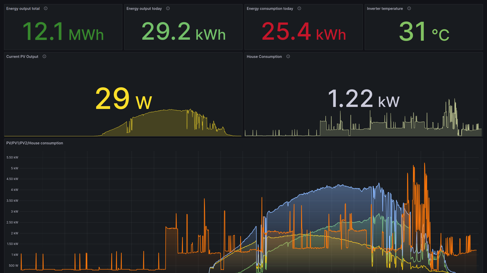

# solar-toolkit

A side project to collect, transport and store data from a Goodwe solar
inverter.

Based on Marcel Blijleven's [Python
library](https://github.com/marcelblijleven/goodwe), ported to Go and
re-packaged as a client/server application.

This project is mostly for personal use - it hasn't been polished for wider
usage and isn't yet compatible with the full range of inverters supported by
the above library (it has been tested against a GW5000-EH).

## Git

The main git repo is: https://git.netflux.io/rob/solar-toolkit

It is also mirrored on GitHub: https://github.com/rfwatson/solar-toolkit

## Components

### solar-toolkit-daemon

A binary which can be triggered using using a cronjob. It queries the inverter
for metrics, parses and encodes them and sends the result over HTTPS to the
server process.

### solar-toolkit-gateway

A binary which accepts incoming HTTP requests containing inverter metrics, and
writes them to a PostgreSQL database.

## Visualisation

Once collected, the metrics can be visualised using any graphing software, e.g.
[Grafana](https://grafana.com/).



## TODO

* (client) improve error handling, e.g. during network outage
* (client) support more Goodwe models
* (client) allow fine-tuning of the collected metrics (e.g. ignore selected
  metrics)
* (database) migrate from fixed schema to a single JSONB column

## Build

```
go build ./...
```

To build the client for linux-arm64 (e.g. Raspberry Pi):

```
GOOS=linux GOARCH=arm go build -o solar-toolkit-daemon ./cmd/daemon
```

## License

Licensed under the MIT license. See the LICENSE file.
